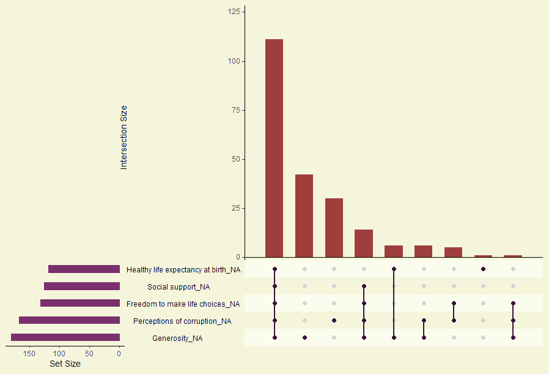

```{r setup, include=FALSE}
knitr::opts_chunk$set(echo = TRUE)
```

```{r WDIPrep, code = readLines('./dataPrepper.R'), echo=FALSE, warning=FALSE, message=FALSE}
```
```{r happyPrep, code = readLines('./happyPrepper.R'), echo=FALSE, warning=FALSE, message=FALSE}
```

## Introduction
The goal of our analysis is to gain insight into what factors contribute towards happiness of populations around the world, and how these factors have changed over time.

Various countries are making progressions as time moves on in areas such as technology, water accessibility, literacy rates, health care, etc. These progressions are known as development indicators and are published by the World Bank. 
In addition, the United Nations publishes a World Happiness Report annually that measures happiness of various countries. 

We are interested in analyzing how such development indicators relate to the global happiness.
For instance, we often hear that money can buy happiness, but is this true? It might also be that higher employment rates relate to a higher happiness score. Our curioustry to test these myths led us to analyzing this dataset. 

Throughout this analysis, we will focus on answering the following three questions:

1. How does happiness scores and indicators relate to the more specific indicators that the World Bank measures?
2. How do certain World Bank indicators correlate with happiness values throughout the past 5 years?
3. How do happiness correlations differ from country to country?

First, we'll describe the data sources and transformations that it underwent before we get to the analysis.

***

## Data sources
For the plots and analysis presented in this report, we merged the findings from two separate data sources: the World Happiness Reports, and the expansive set of World Bank indicators.

### World Happiness Report
To examine happiness, we utilized the annual World Happiness Reports from 2015 to 2019. An important thing to note is that the publishing year of the report references data collected from the *previous* year i.e. the 2019 World Happiness Report utilizes 2018 data. Each report has released data that they used to make the happiness plots. Included are the indicators that they have used. These indicators stay constant each year:

- Gross Domestic Product (GDP)
- Social support
- Healthy life expectancy at birth
- Freedom to make life choices
- Generosity
- Perceptions of corruption

The report details the exact meanings of these indicators each year. There is one record for each country that was measured for that report. The numbers vary each year, from 150 one year to only about 136 the next. However, the major countries are always present. 

Some issues is that although a happiness score will be present for each country, the raw values for the indicators above may not be. Additionally, each file can have inconsistencies with the column names and sheet names. 

### World Bank indicators
The World Bank houses an interactive data bank (located [here](https://data.worldbank.org/indicator)) with more than 1400 indicators for all the countries. The earliest year for some of these indicators is 1965, and it is continuously updating for the current year as data becomes available. In addition to each country, they also present aggregates for different regions of the globe, such as the Arab World, South Asia, and North America. The details of which countries belong to which group are also located at the website.

The indicators themselves span multiple domains, from the economy to the health sector. Gross Domestic Product (GDP) measures are present, as well as population, education, immunization, energy consumption, and employment measures.

Although there is space to have data from the 1960s, a vast majority of the time, that data is missing. This is mostly due to not having the capacity to measure that data during that time. However, 21st century data is usually present for a huge number of indicators, and so it works well for the goal of this report.

With respect to indicator values, each indicator can have an expansive description that describes the original data source, how it was calculated, as well as any statistical tests that may been used to alter the original value.

***

The merging of this data required some subsetting the World Bank indicators to a small fraction of its size, according to constraints we imposed.

## Data Transformation
We broke up our initial data transformation between the two datasets we used. A certain transformation was used for the World Bank indicators, and another was used for the Happiness data.

### World Bank Indicators
Looking at all 1400 World Bank indicators at once will obviously be very efficient. Additionally, it is not guaranteed that every single indicator will have values for the past 5 years. For this reason, **we only took indicators that had values for each year from 2014 to 2018**. After this subsetting was done, we had around 125 final indicators we could analyze on. These indicators generally covered basic statistics, such as GDP, population, etc. but also had variables in other areas of the economy.

### Happiness
The World Happiness Report was started in 2012, and has since been an annual occurrence, except for the 2014 report. Additionally, data was only released to the public since the 2015 report onwards. The report itself is tens of pages long, but the data used is released to the public as standard Microsoft Excel workbooks. In general, there is one sheet which had raw values for the six primary indicators detalied above, and another sheet which had the calculated happiness scores for each country in the report.

Additionally, there were inconsistencies in the sheet and column names that needed to be explicitly written down. The 2015 sheet also had its data moved 2 rows down, and this had to be moved up to match the other report's data. We also had to take careful note that the list of countries in the report vary from year to year, as this impacted how we merge the two datasets.

### Merging the two datasets
The main issue that arose when merging was that **countries in the happiness dataset did not match the ones in the World Bank dataset**. For example, "Palestinian Territories" was listed in the happiness data, but the World Bank gave it the other official name of "West Bank and Gaza". For the full list of mismatches, please consult our github page. Fortunately, the list was small enough that we could explicitly convert the mismatched countries in the happiness dataset.

Next, the World Bank dataset also had listed regions of countries, such as the Arab World and South Asia. To automatically remove these and since we are interested in how happiness relates to our data, we prioritized the **countries in the happiness dataset** when we merged the two.

The result is that we have a set of World Bank indicators AND a set of happiness indicators for each country and year. Through the process, the amount of missing data in the result was mitigated. However, even after this merge, we still had some missing patterns.

***

## Missing data
We still need to address the issue of what data are missing. Fortunately, this handy graph below can tell us which variables are missing as well as how much of it is missing. As stated above, our transformed World Bank dataset will not have any missing data by construction. However, we still have some missing data in the happiness data set.
```{r missing, echo=FALSE, fig.width=10, fig.height=8, message=FALSE, warning=FALSE}
library(visdat)
library(ggplot2)
library(plotly)
library(reshape2)
library(colorspace)
library(naniar)
wdi <- read.table('./WDI-tidied.csv', sep = ',', header = TRUE, check.names = FALSE)
happy <- read.table('./happy.csv', sep = ',', header = TRUE, check.names = FALSE)

# For each year, subset it, merge the datasets,
# and calculate the correlation matrix...
wdiThisYear <- wdi[wdi$Year == 2018,]
happyThisYear <- happy[happy$Year == 2018,]
# Merge on country name and year (to prevent two year columns)
mergedData = merge(wdiThisYear, happyThisYear, by = c("Country Name", "Year"), all.y = TRUE)
# Happiness are the last 5 columns, excluding the happiness column...
cormat = cor(x = mergedData[,3:128], y = mergedData[,129:134], use = "complete.obs")

# gg_miss_upset(happy, 
#               matrix.color = "#37123C", 
#               main.bar.color = "#9E3F3D", 
#               sets.bar.color = "#7A306C", 
#               shade.color = "#EBF8B8", 
#               text.scale = 1.3, 
#               matrix.dot.alpha = 1, 
#               line.size = 1,
#               show.numbers = "no"
# )
# Result was saved into Paint.NET and changed background color to match document.

```



The UpSet plot only shows variables which have missing data. Because the variables representing the happiness score, country, or year were displayed, this implies that we actually have a happiness score for each country and for each year. Many times, however, all 5 of the indicators were missing, yet still there was still was score. How can this be the case that we have a calculated score when we don't have raw indicators? Well, the report has answered exactly that, as they detail how they obtained the data for those indicators. From the [Statistical Appendix](https://s3.amazonaws.com/happiness-report/2019/WHR19_Ch2A_Appendix1.pdf), we see that they healthy life expectancy is actually measured by the World Health Orgainization, and only for the years 2000, 2005, 2010, 2015, and 2016. At times, the actually used "interpolation and extrapolation". They also note "[a] few territories/countries are not covered in the WHO data." This explains partly the missing values for healthy life expectancy.

In the other indicators, the average of responses to relevant Gallup World Poll (GWP) questions were taken. For example, for the "Social support" category, the relevant GWP question was "If you were in trouble, do you have relatives or friends you can count on to help you whenever you need them, or not?". If this question was not asked in a specific country, then naturally that data will end up missing. 

Section 3 of that appendix details how they **imputed** the missing data in order to compute happiness scores. In most cases, they utilized additional sources, or past averages of values if they were available. However, it seems as though they did not update the raw values for these indicators in the Excel workbook.

*But*, in actuality, the happiness score lives in another sheet. In that sheet, we have values for the *explainability* of all the indicators. That is, how much does each variable explain the happiness for that country. Our guess is that they have used the imputed values to calculate these explainiabliity factors. 

Due to missing factors, later on when we report on how happiness correlates with the indicators from the World Bank, we will only be using the actual happiness values. However, we still measure the immediate correlation for all the happiness indicators. In this case, the missing values are simply ignored in the correlatino calculation.

***

## How does happiness scores and indicators relate to the more specific indicators that the World Bank measures?

First, we want to see, in a broad sense, what specific World Bank indicators relate closely with the indicators that the World Happiness Reports use, as well as the actual score. To quantify, we can measure the correlation between each World Bank indicator and each happiness indicator for all countries in 2018. A correlation heatmap for each possible pair is seen below. World Bank indicators are placed alphabetically on the $x$-axis. Please hover to see the pair and its value.

```{r correlation, echo=FALSE, fig.width=10, fig.height=8, message=FALSE, warning=FALSE}
# Now build the plot...
meltedCor = melt(cormat)
colnames(meltedCor) <- c("WDI", "Happiness", "Correlation")

p <- plot_ly(x = row.names(cormat), 
             y = colnames(cormat), 
             z = t(as.matrix(cormat)), 
             type = "heatmap",
             colorscale = "Electric",
             name = "Correlation",
             hovertemplate= paste('%{x}', '<br><i>vs.</i>', '<br>%{y}', '<br><b>%{z:.3f}</b>')) %>%
  layout(
    font = list(family = "'Montserrat', sans-serif"),
    title = "<b>Correlation of WB Indicators vs. Happiness Indicators in 2018</b>",
    titlefont = list(size = 22),
    xaxis = list(showticklabels = FALSE, showgrid = FALSE),
    yaxis = list(tickangle = -30,
                 tickfont = list(size = 16)),
    margin = list(l = 250, t = 50),
    paper_bgcolor = 'transparent'
  )
p
```

The results are somewhat interesting. For one thing, regardless of the World Bank indicator, healthy life expectancy and social support seem to correlate with similar variables, and extreme at that. Even more so, these two determine the actual happiness score much more closely than the other 3. In fact, we can see that the other 3 indicators' correlations are closer to 0.

In terms of the actual World Bank indicators, we see that mortality rates correlate very strongly against social support, and healthy life expectancy. The reason should be clear, as if mortality rates are high, then life expectancy naturally falls, and an increased amout of social support is needed. Additionally, the amount of vulnerable employment also correlates against these indicators.

In the other direction, GDP and wage correlate very well in favor of the values for social support and healthy life expectancy at birth. Interestingly however, they also correlate **against** the corruption indicator. This indicates that although people might be enjoying the increased wealth, they also might be questioning their government as to how that wealth was obtained. However, this thought isn't very severe, as the correlation value of -0.45 isn't a high magnitude.

Finally, one interesting pair of indicators are the *Urban population* and *Urban population growth*. Although these are highly linked, the former is correlated **in favor of** social support, healthy life expectancy, and hence happiness, the latter is actually correlated **against** these very same factors, to the same magnitude as well. This could be sign of urban citizens feeling happy that they are in the city (perhaps working a well-paying job?), they do not like others setting up shop in said city (perhaps these new people can compete for the very same high-paying jobs?).

***
We've seen how the World Bank indicators can affect happiness indicators, but the above correlation matrix was only for the year 2018. Would those World Bank indicators that held an extreme correlation in favor of or against still hold them for the past 5 years?
```{r allCorrelation, echo=FALSE}
years = 2014:2018
allCors = data.frame(matrix(ncol = 3, nrow = 0))
for (year in years) {
  # For each year, subset it, merge the datasets,
  # and calculate the correlation matrix...
  wdiThisYear <- wdi[wdi$Year == year,]
  happyThisYear <- happy[happy$Year == year,]
  # Merge on country name and year (to prevent two year columns)
  mergedData = merge(wdiThisYear, happyThisYear, by = c("Country Name", "Year"), all.y = TRUE)
  # Happiness are the last 5 columns, excluding the happiness column...
  cormat = cor(x = mergedData[,3:128], y = mergedData[,129:134], use = "complete.obs")
  
  # Now build the plot...
  meltedCor = melt(cormat)
  colnames(meltedCor) <- c("WDI", "Happiness", "Correlation")
  meltedCor = meltedCor[meltedCor$Happiness == "Happiness score",]
  # Append the column saying the year to the beginning.
  meltedCor <- cbind(Year = year, meltedCor[,-2])
  # Append rows to allCors...
  allCors <- rbind(allCors, meltedCor)
}
```

***

## How do certain World Bank indicators correlate with happiness values throughout the past 5 years?
We'll break up our analysis into indicators that have positively and negatively correlated with happiness. Additionally, we'll also look at some indicators that we personally believe should be affecting happiness.

### Positively Correlated Indicators
One clear indictar that has positively affected is **GDP**. We'll see how this is correlated with happiness throughout the past 5 years. Note that this just for the entire world, not individual countries.
```{r positiveIndicators, echo=FALSE, fig.width=10, fig.height=8, warning=FALSE}
reqInd = c("GDP per capita, PPP (current international $)",
           "Urban population (% of total population)",
           "Wage and salaried workers, total (% of total employment) (modeled ILO estimate)",
           "Domestic credit to private sector by banks (% of GDP)")
positiveIndicators = allCors[allCors$WDI %in% reqInd,]
# Unmelt it...
unmelted <- dcast(data = positiveIndicators, formula = Year~WDI, fun.aggregate = sum, value.var = "Correlation")
# Calculate change from 2014...
unmelted[,2:5] <- apply(unmelted[,2:5], 2, function(x) {(x / x[1] - 1) * 100})
colors = c("violet", "#5612CC", "9E3F3D", "red")
# First trace...
p <- plot_ly(data = unmelted,
             x = ~Year,
             y = as.formula(paste0("~`", reqInd[1], "`")),
             name = substr(reqInd[1], 1, gregexpr('\\(', reqInd[1])[[1]][1] - 2),
             type = 'scatter',
             mode = 'lines',
             line = list(color = colors[1]),
             hovertemplate = paste('<b>%{y:2.2f}%</b>')
)
# For the rest, add traces as necessary...
for (i in 2:4) {
  ind = reqInd[i]
  p <- p %>% add_trace(
    y = as.formula(paste0("~`", ind, "`")),
    name = substr(ind, 1, gregexpr('\\(', ind)[[1]][1] - 2),
    line = list(color = colors[i]),
    hovertemplate = paste('<b>%{y:2.2f}%</b>')
  )
}
p <- layout(p,
  font = list(family = "'Montserrat', sans-serif"),
  title = "<b>% Change of Correlation of Positive WB Indicators wrt 2014</b>",
  titlefont = list(size = 22),
  xaxis = list(dtick = 1,
               title = "<i>Year</i>",
               titlefont = list(size = 18)),
  yaxis = list(title = "<i>Percentage Change from 2014</i>",
               titlefont = list(size = 18)),
  legend = list(x = 0, y = 0, xpd = TRUE),
  plot_bgcolor = 'transparent',
  paper_bgcolor = 'transparent',
  margin = list(r = 50, t = 50),
  hovermode = 'compare'
)
             
p
```

From the graph, we can gleam a couple of things: **GDP** has historically been always correlated with happiness. This is also probably one of the reasons the World Happiness Report regularly includes it in its annual report. The percentage of **urban population** is also unchanged in its correlation values.

However, more interestingly, the correlation for the amount of **waged and salaried workers** has actually dropped 10% since 2014! Even though it is a fairly high correlation value in 2018, it was higher in the past. This could be indication that people have been minorly worrying about other factors for their happiness other than just their wage.

Finally, the amount of domestic credit given to the private sector has been relatively erratic with its correlation. Although this value was highly correlated, the fact that the actual value has been jumping up and down could indicate that it does not necessarily determine happiness.

One interesting trend here is that in the first year, 3 of the 4 indicators all dropped their correlation values by a fair bit. In the next year, these jumped up, except for wage, which had less extreme downturn. The year of 2015 marked an uptick in the refugee crisis, and citizens around the world most likely saw how little the refugees had, and started to appreciate their current monetary holdings, regardless of what it was.

### Negatively Correlated Variables
From our heatmap above, we can see that **vulnerable employment** and **mortality rates** are negatively correlating with happiness for 2018. We'll see if this trend held for the past 5 years. Now, since we are more interested in the magintude of the correlation, rather than the sign in this section, the correlation values have been forced to be positive.
```{r negativeCorrelation, echo=FALSE, fig.width=10, fig.height=8, warning=FALSE}
reqInd = c(
  "Vulnerable employment, total (% of total employment) (modeled ILO estimate)",
  "Mortality rate, infant (per 1,000 live births)",
  "Rural population (% of total population)",
  "Age dependency ratio, young (% of working-age population)"
)
negativeIndicators = allCors[allCors$WDI %in% reqInd,]

# Unmelt it...
unmelted <- dcast(data = negativeIndicators, formula = Year~WDI, fun.aggregate = sum, value.var = "Correlation")
# Calculate change from 2014...
unmelted[,2:5] <- apply(unmelted[,2:5], 2, function(x) {(abs(x) / abs(x[1]) - 1) * 100})
# First trace...
p <- plot_ly(data = unmelted,
             x = ~Year,
             y = as.formula(paste0("~`", reqInd[1], "`")),
             name = substr(reqInd[1], 1, gregexpr('\\(', reqInd[1])[[1]][1] - 2),
             type = 'scatter',
             mode = 'lines',
             line = list(color = colors[1]),
             hovertemplate = paste('<b>%{y:2.2f}%</b>')
)
# For the rest, add traces as necessary...
for (i in 2:4) {
  ind = reqInd[i]
  p <- p %>% add_trace(
    y = as.formula(paste0("~`", ind, "`")),
    name = substr(ind, 1, gregexpr('\\(', ind)[[1]][1] - 2),
    line = list(color = colors[i]),
    hovertemplate = paste('<b>%{y:2.2f}%</b>')
  )
}
p <- layout(p,
  font = list(family = "'Montserrat', sans-serif"),
  title = "<b>% Change of Correlation of Negative WB Indicators wrt 2014</b>",
  titlefont = list(size = 22),
  xaxis = list(dtick = 1,
               title = "<i>Year</i>",
               titlefont = list(size = 18)),
  yaxis = list(title = "<i>Percentage Change from 2014</i>",
               titlefont = list(size = 18)),
  legend = list(x = 0, y = 0, xpd = TRUE),
  plot_bgcolor = 'transparent',
  paper_bgcolor = 'transparent',
  margin = list(r = 50, t = 50),
  hovermode = 'compare'
)
p
```
How about that? Every single indicator shown above has shown a sharp downturn in how correlated it is with happiness. **Mortality rate**'s correlation has decreased by more than 16% since 2014! **Vulnerable employment** and the **age dependency ratio of young to employees** has also decreased quite a bit. However, we can note that some of them have experience an uptick on a year-to-year to basis, such as with vulnerable employment and the young to empolyee dependency ratio.

Interestingly enough, the rural population's correlation *did* in fact stay the same until about 2016, when it started to decrease. Now, recall that our previous graph had **Urban population**, which was correlated in favor of happiness. It is completely plausible that during the past 5 years, there has been a substantial increase in the number of people moving to cities, which leads to them being happier in general. Cities also usually have more stable employment, and better health facilities to minimize the number of infant deaths. Just from the fact that an increased number of people have been moving to cities, one can make the argument that the indicators graphed above are declining in importance across the board.

### Other Indicators
What about those indicators that do not have extreme values i.e. ones with correlations close to 0? We decided to examine 4 more indicators that do not correlate with happiness very well. These are:
- Primary school starting age
- Number of days to get electricity
- Unemployment(!)
We suspected that the primary school starting age should at least affect happiness, as starting school later directly means more family time for the young kids. We also believed that as the time to get electricity increases, the overall happiness decreases, as that a huge setback in how citizens can go about their day-to-day lives. Surprisingly, the actual unemployment doesn't affect happiness at all (a correlation that is essentially 0 for 2018). Let's see how the correlation trends are:
```{r otherGraph, echo=FALSE, fig.width=10, fig.height=8, warning=FALSE}
reqInd = c(
  "Primary school starting age (years)",
  "Time required to get electricity (days)",
  "Unemployment, total (% of total labor force) (modeled ILO estimate)"
)
zeroIndicators = allCors[allCors$WDI %in% reqInd,]

# Unmelt it...
unmelted <- dcast(data = zeroIndicators, formula = Year~WDI, fun.aggregate = sum, value.var = "Correlation")
# Calculate change from 2014...
unmelted[,2:4] <- apply(unmelted[,2:4], 2, function(x) {(abs(x) / abs(x[1]) - 1) * 100})
# First trace...
p <- plot_ly(data = unmelted,
             x = ~Year,
             y = as.formula(paste0("~`", reqInd[1], "`")),
             name = substr(reqInd[1], 1, gregexpr('\\(', reqInd[1])[[1]][1] - 2),
             type = 'scatter',
             mode = 'lines',
             line = list(color = colors[1]),
             hovertemplate = paste('<b>%{y:2.2f}%</b>')
)
# For the rest, add traces as necessary...
for (i in 2:3) {
  ind = reqInd[i]
  p <- p %>% add_trace(
    y = as.formula(paste0("~`", ind, "`")),
    name = substr(ind, 1, gregexpr('\\(', ind)[[1]][1] - 2),
    line = list(color = colors[i]),
    hovertemplate = paste('<b>%{y:2.2f}%</b>')
  )
}
p <- layout(p,
  font = list(family = "'Montserrat', sans-serif"),
  title = "<b>% Change of Correlation of Uncorrelated WB Indicators wrt 2014</b>",
  titlefont = list(size = 22),
  xaxis = list(dtick = 1,
               title = "<i>Year</i>",
               titlefont = list(size = 18)),
  yaxis = list(title = "<i>Percentage Change from 2014</i>",
               titlefont = list(size = 18)),
  legend = list(x = 0, y = 0, xpd = TRUE),
  plot_bgcolor = 'transparent',
  paper_bgcolor = 'transparent',
  margin = list(r = 50, t = 50),
  hovermode = 'compare'
)
p
```
We can see that the correlation for the electricity time generally stayed the same, but the correlation for unemployment had all but disappeared in those 5 years. Taking a peak at the data, we see that the correlation for unemployment in 2014 was actually close to 0.13. This could be a sign of the collective citizens of the world placing their importance elsewhere instead of the job. Regardless of whether they have a job, picking up hobbies generally increases happiness. 

Interestingly, the starting age for primary school initially lost its correlation, but then regained it to its former 2014 levels. For reference, the actual value of this correlation in 2018 was -0.195. This actually indicates that as the starting age increases, happiness decreases, albeit weakly. It was completely contradictory to our beliefs (which is definitely exciting) before we did this project. Maybe the world places a more of an importance of getting basic education as early as possible than once we initially thought?

***

## How do happiness correlations differ from country to country?

We've seen how happiness correlates with World Bank indicators throughout the years, but what happens at a country level? Do Americans' happiness correlate with the same or similar indicators as do the Chinese? What about European nations and Scandinavian nations (Finland has been the happiest country 2 years running)?

To help visualize this, we’ve created an [interactive world map](https://bl.ocks.org/prajbabu/raw/64632ce0480ca5bdfdc03ebe55189d20/12a274ef2c6317be19034e950be307cfcd3b3d35/) which allows you to select any country to see which World Bank development indicator was the most positively correlated to the happiness score for that country, the most negatively correlated to the happiness score for that country, for the past 5-year time period between 2014 and 2018. You can see how these two indicators, along with happiness, change over this time. We've compiled our thoughts on three countries below, the United States, China, and Finland.

Upon selecting a country, you can see a line chart depicting the percent change over the last 5 years for values of the two indicators and the percent change in the country's happiness score.

### United States
Upon clicking the United States, the line chart that pops up depicts the percent changes of the **personal remittances received** a.k.a. income from a foreign economy as a positively correlated indicator, the **labor force participation rate** as the negatively correlated indicator, and the USA's happiness. You will notice that even though the labor participation rate has increased over time, the happiness has decreased. Perhaps this is due to the large drop in personal remittances. This means that more people are dependent on money incoming from sources outside the United States, such as family living abroad, or employers abroad. 

### China
Let’s take a look at another major country’s indicators: China.
Well, this country’s happiness scores seems to have slightly increased over the last 5 years. The most positively correlated indicator is the **net barter terms of trade index** while the most negatively correlated indicator is the import unit value index. The net barter terms of trade index is simply the ratio of the export unit value index to the import unit value index ratio. The higher this ratio, the more valuable its exports are in relation to its imports. Because its import unit value index is also decreasing during this time, China's increase in happiness relates directly to its increased value of its exports. 

### Finland
Finally, how about a country that’s been ranked the happiest the past 2 years?
Finland’s happiness scores hasn't fluctuated much over the past 5 years. The most positively correlated indicator is the amount of secure internet servers. This value was increased more than 1000% since 2014. Data storage on the cloud is becoming a priority for many companies, and Finland is a country where many choose to build their remote servers. For instance, Google and Minecraft have placed their remote servers here. Perhaps this brings in a large income to the Country, while also providing job opportunities to residents. We can also notice that a decrease in the youth population (aged 0 -  14) correlates to happiness. 

As you can see, the indicators that correlate to happiness vary from country to country and it’s fun to come up with reasons/explanations as to why these indicators are correlated. 

Feel free to click on a few countries and compare the correlated indicators!

***

## Conclusion and Future Work
During the course of this analysis, we faced a few limitations. Initially we anticipated to analyze values of the development indicates for a longer time frame (i.e 2000-2019), but we soon came to realize that the World Bank indicators dataset contains many missing values, as they did not have the means to measure many indicators until the more recent years. Also, the World Happiness Report did not publish annually till 2015, thus restraining our analysis to be between 2015 and 2019. In addition, for the data between the years 2015 - 2019, many countries were excluded from the analysis due to missing values. Many of these countries were developing countries that might not have policies in place yet to measure development indicators. 

We also want to convey the importance that **correlation does not imply causation**. Even though an indicator may be correlated with happiness, it does not mean it causes it directly. There are could a bevy of other factors that could cause happiness, and the World Happiness Report aims to examine those factors.

In the future, we think it would be interesting to not only view the highly correlated development indicators for each country, but also for each region i.e North America, EU, Middle East, East Asia, etc.

From this project, we learned how to deal with large datasets and extract fields of interest to our analysis. We also learned how to merge datasets based on a key column (Country Name) and the problems that arise when different sources have different naming conventions. And finally, we gained experience with using a TopoJSON file that contains country coordinates, boundaries, and identifier values to plot an interactive world map using D3. 
